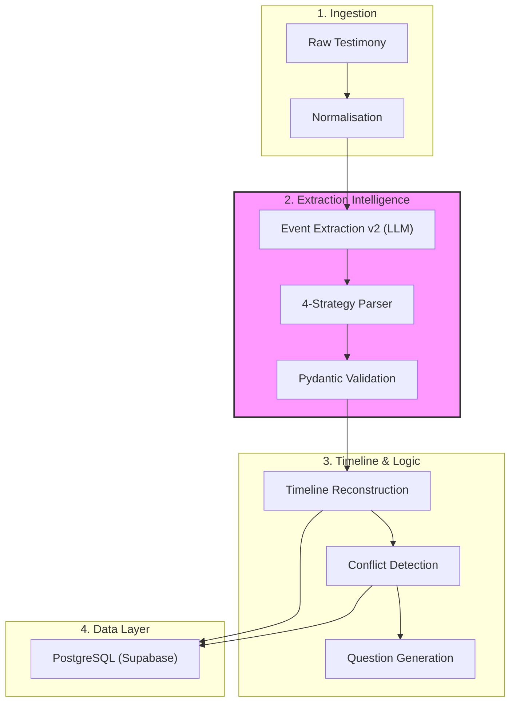

# Narrative Merge Engine

**Git-Inspired Intelligence for Testimony Reconstruction.**

> "Memory is fragmented, emotional, and non-linear. Narrative Merge Engine is the version control for human testimony."

---

## Overview

The **Narrative Merge Engine** is a high-performance, async-first backend designed to reconstruct complex event timelines from fragmented witness testimonies. Using advanced LLM orchestration and clean architecture, it treats human memory like a distributed version control system — which helps in identifying conflicts, resolving temporal ambiguities, and merging divergent accounts into a single, unified narrative truth.

### Key Capabilities
- **Decomposition**: Breaking down non-linear, multi-lingual (Hindi/English/Hinglish) prose into atomic events.
- **Conflict Detection**: Automatically identifying contradictions in timing, location, or actor descriptions across different witnesses.
- **Uncertainty Tracking**: Explicitly modeling "maybe", "around", and "I think" to prevent false precision.
- **Temporal Alignment**: Resolving relative markers (e.g., "baad mein", "after the noise") into a global timeline.
- **Investigation Assistance**: Generating clarifying questions to resolve found contradictions and close narrative gaps.

---

## Architecture



---

## Technical Stack

| Component | Technology | Rationale |
|-----------|------------|-----------|
| **Framework** | [FastAPI](https://fastapi.tiangolo.com/) | Async-first, high performance, native OpenAPI. |
| **Database** | [PostgreSQL](https://www.postgresql.org/) + [SQLAlchemy 2.0](https://www.sqlalchemy.org/) | Robust relational model with full async support via `asyncpg`. |
| **Orchestration** | [Tenacity](https://tenacity.readthedocs.io/) | Exponential backoff and retry for resilient AI calls. |
| **Intelligence** | [LLM Orchestrator](app/core/ai/orchestrator.py) | Provider-agnostic abstraction for OpenAI, Anthropic, or Gemini. |
| **Validation** | [Pydantic v2](https://docs.pydantic.dev/) | Strict typing and data integrity for LLM outputs. |
| **Logging** | [Structlog](https://www.structlog.org/) | Structured, searchable logs for production observability. |

---

## Feature Specifications

### 1. Robust Event Extraction
The `EventExtractionService` serves as the core intelligence layer, managing:
- **Testimony Chunking**: Overlapping windows for long-form testimonies to ensure data continuity.
- **Multi-lingual Context**: Fine-tuned prompting for code-switching environments (e.g., Hindi-English).
- **Source Provenance**: Verification of every extracted event against original text via fuzzy matching to mitigate hallucination risks.
- **Resilient Processing**: Graceful degradation logic that rescues valid events from partial LLM failure and triggers targeted retries.

### 2. Uncertainty Classification
Temporal data is managed via a six-category uncertainty framework rather than fixed timestamps:
- `hedged`: Indicates witness uncertainty (e.g., "I think", "shayaad")
- `approximate`: Indicates estimated values (e.g., "around 9", "lagbhag")
- `relative`: Signals temporal dependency (e.g., "after that", "later")
- `missing`: Indicates absence of temporal data
- `conflicting`: Marks internal contradictions within a single account
- `none`: Reserved for clear, unambiguous statements

### 3. Git-Inspired Conflict Resolution
Extracted events are modelled as commits within a narrative branch. The system's Merge Engine identifies semantic conflicts where divergent testimonies provide mutually exclusive accounts of chronological events.

---

## Project Structure

```text
app/
├── api/v1/         # Versioned endpoints (testimonies, events, timeline)
├── core/           # Configuration, Security, Logging, and AI Orchestration
├── db/             # Database connection and session management
├── models/         # Pydantic schemas and SQLAlchemy ORM models
├── repositories/   # Data access layer (async CRUD logic)
└── services/       # Core business logic (Extraction, Reconstruction, Conflicts)
tests/              # Comprehensive test suite (async HTTP clients + LLM mocks)
alembic/            # Database migration management
main.py             # Application entry-point
```

---

## Quick Start

### 1. Prerequisites
- Python 3.11+
- Redis (optional, for caching)
- PostgreSQL (or Supabase)

### 2. Installation
```bash
# Clone the repository
git clone https://github.com/YourOrg/narrative-merge-engine.git
cd narrative-merge-engine

# Install dependencies via Poetry
poetry install
```

### 3. Configuration
Generate a `.env` file from the provided template:
```bash
cp .env.example .env
# Configure DATABASE_URL and LLM_API_KEY in the .env file
```

### 4. Database Migrations
```bash
poetry run alembic upgrade head
```

### 5. Deployment
```bash
poetry run uvicorn app.main:app --reload
```
Interactive API documentation is available at `http://localhost:8000/docs`.

---

## Test Suite

The repository includes a comprehensive asynchronous test suite.
```bash
# Execute all tests
poetry run pytest

# Generate coverage report
poetry run pytest --cov=app tests/
```

---

## License

[MIT License](LICENSE) — Focused on forensic integrity and system reliability.

